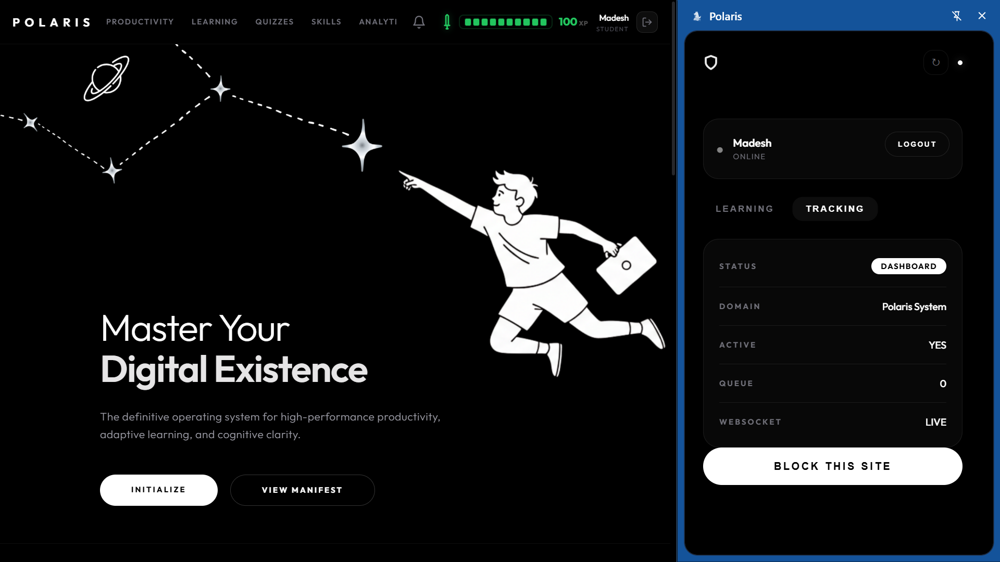
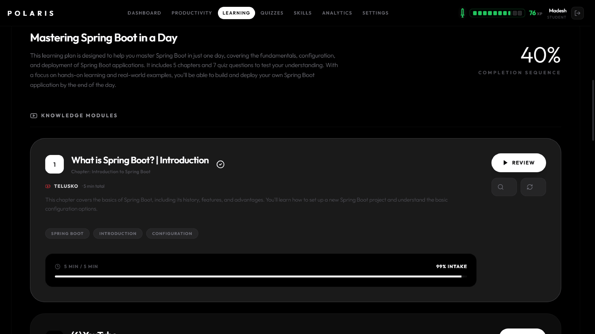
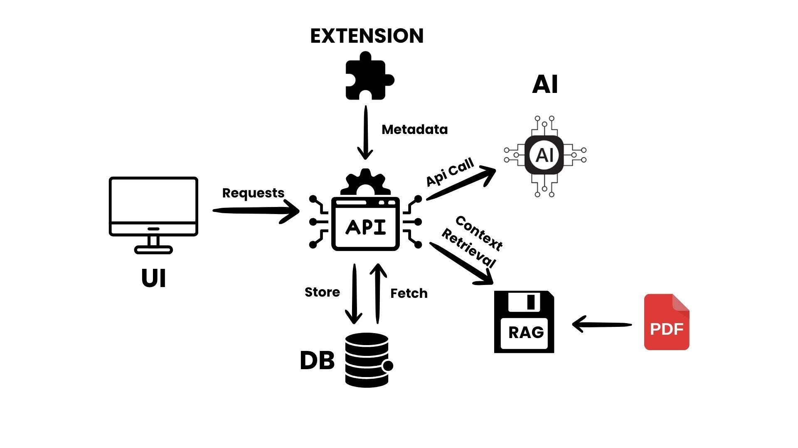

<div align="center">

<br/>

<a href="https://github.com/Madeshmadmax7/Polaris">
  
</a>


<br/>
<br/>


<br/>
<br/>


<br/>

**Polaris Tracker is an AI-powered productivity intelligence platform designed to monitor user activity, analyze behavioral patterns, and generate intelligent productivity insights through browser telemetry, NLP, and real-time analytics.**

<br/>

<p align="center">

<a href="#features">
  
</a>

<a href="#system-architecture">
  
</a>

<a href="#technology-stack">
  
</a>

<a href="#repository-setup">
  
</a>

</p>

</div>

---

## Overview

Polaris Tracker combines a Chrome Extension, FastAPI backend, NLP intelligence engine, and React analytics dashboard into a unified ecosystem capable of tracking activity, analyzing focus sessions, generating semantic productivity insights, and visualizing user behavior in real time.

<br/>

<table width="95%">
<tr>

<td width="50%" valign="top">

## Why Polaris?

- Real-time browser activity monitoring
- AI-powered productivity analysis
- Interactive analytics dashboard
- NLP-driven behavioral intelligence
- Real-time synchronization pipeline
- Lightweight telemetry architecture
- Secure and privacy-focused design
- Intelligent productivity reporting

</td>

<td width="50%" valign="top">

## Built With

- **Frontend:** React · Vite · Tailwind CSS
- **Backend:** FastAPI · Python · WebSockets
- **AI Layer:** NLP · FAISS · Semantic Analysis
- **Database:** MySQL · Redis
- **Extension:** Chrome Manifest V3
- **Infrastructure:** Docker · Linux · GitHub

</td>

</tr>
</table>
---

# Features

## Productivity Analytics Dashboard

<table width="100%">
<tr>
<th width="50%" align="center">Dashboard Overview</th>
<th width="50%" align="center">Productivity Monitoring</th>
</tr>

<tr>
<td align="center" valign="top">


</td>

<td align="center" valign="top">


</td>
</tr>
</table>

<br/>

The analytics dashboard provides comprehensive visualization of user productivity patterns, focus sessions, active time tracking, and behavioral insights.

### Core Capabilities

- Real-time productivity metrics
- Daily and weekly analytics reports
- Interactive visualization panels
- Focus session analysis
- Website usage statistics
- Timeline-based activity tracking
- Session history monitoring
- Progress and consistency analysis

---

## Chrome Extension Tracking

<div align="center">



</div>

<br/>

The Chrome Extension acts as the telemetry collection layer of Polaris Tracker. It continuously captures browser activity data and synchronizes it with backend infrastructure in real time.

```text
Browser Activity
      ↓
Manifest V3 Extension
      ↓
Activity Processing
      ↓
Secure Backend APIs
      ↓
Analytics Dashboard
```

### Extension Features

- Browser activity collection
- Lightweight telemetry system
- Background synchronization
- Real-time activity streaming
- Manifest V3 architecture
- Low-overhead monitoring
- Secure API communication

---

## NLP Intelligence Engine

<table>
<tr>
<td width="50%">

### AI Capabilities

- Semantic behavior analysis
- NLP-driven activity interpretation
- Productivity recommendation engine
- Behavioral pattern recognition
- AI-generated insights
- FAISS vector similarity search

</td>

<td width="50%">

```text
User Activity
      ↓
Behavioral Processing
      ↓
NLP Semantic Analysis
      ↓
Pattern Recognition
      ↓
AI Productivity Insights
```

</td>
</tr>
</table>

---

## Course Progress & Monitoring

<div align="center">



</div>

<br/>

Polaris includes intelligent progress tracking systems capable of visualizing completion metrics, consistency analysis, structured monitoring, and productivity progression.

### Monitoring Features

- Progress visualization
- Completion analytics
- Structured tracking system
- Performance monitoring
- Consistency analysis
- Activity-based reporting

---

# System Workflow

<div align="center">



</div>

---

# System Architecture

```text
 ┌──────────────────────────┐
 │    Chrome Extension      │
 │ Activity Tracking Layer  │
 └────────────┬─────────────┘
              │
              │ HTTPS / WSS
              ▼
 ┌──────────────────────────┐
 │      FastAPI Backend     │
 │ Authentication + APIs    │
 │ Analytics Processing     │
 └────────────┬─────────────┘
              │
      ┌───────┴────────┐
      ▼                ▼
 ┌───────────┐   ┌─────────────┐
 │   MySQL   │   │ NLP Engine  │
 │ Database  │   │ + FAISS AI  │
 └───────────┘   └─────────────┘
              │
              ▼
 ┌──────────────────────────┐
 │     React Dashboard      │
 │ Productivity Analytics   │
 └──────────────────────────┘
```

---

# Technology Stack

| Frontend | Backend | AI / NLP | Infrastructure |
|:---|:---|:---|:---|
| React.js | FastAPI | NLP Processing | MySQL |
| Vite | Python | FAISS Vector Search | Redis |
| JavaScript | Uvicorn | Semantic Analysis | Docker |
| HTML5 | REST APIs | Recommendation Engine | Linux |
| CSS3 | WebSockets | AI Analytics | GitHub |
| Tailwind CSS | Authentication APIs | Data Intelligence | Postman |

---

# Application Flow

```text
User Activity
      │
      ▼
Chrome Extension
      │
      ▼
FastAPI Backend APIs
      │
 ┌────┴─────┐
 ▼          ▼
MySQL     NLP Engine
 │          │
 └────┬─────┘
      ▼
React Dashboard
      │
      ▼
Analytics & Insights
```

---

# Project Structure

```bash
Polaris/
│
├── backend/          # FastAPI backend services
├── frontend/         # React analytics dashboard
├── extension/        # Chrome extension telemetry layer
├── screenshots/      # README assets
│
└── README.md
```

---

# Modules

| Module | Description |
|:---|:---|
| Chrome Extension | User activity tracking and telemetry |
| FastAPI Backend | APIs and analytics processing |
| NLP Engine | AI-powered productivity intelligence |
| React Dashboard | Analytics visualization system |
| MySQL Database | Persistent storage layer |
| WebSocket Layer | Real-time synchronization |

---

# Deployment

| Service | Platform |
|:---|:---|
| Frontend | Netlify |
| Backend | Render / VPS |
| Database | MySQL |
| APIs | FastAPI |
| Extension | Chrome Browser |

---

# Repository Setup

<details>
<summary><b>Frontend Setup</b></summary>

```bash
cd frontend
npm install
npm run dev
```

</details>

---

<details>
<summary><b>Backend Setup</b></summary>

```bash
cd backend

python -m venv venv

# Windows
venv\Scripts\activate

# Linux / Mac
source venv/bin/activate

pip install -r requirements.txt

uvicorn main:app --reload
```

</details>

---

<details>
<summary><b>Chrome Extension Setup</b></summary>

```bash
# Open chrome://extensions/

# Enable Developer Mode

# Click "Load unpacked"

# Select extension/ folder
```

</details>

---

# Clone Repository

```bash
git clone https://github.com/Madeshmadmax7/Polaris.git
```

---

<div align="center">


<br/>


<br/>

Star this repository if you found Polaris useful

</div>
