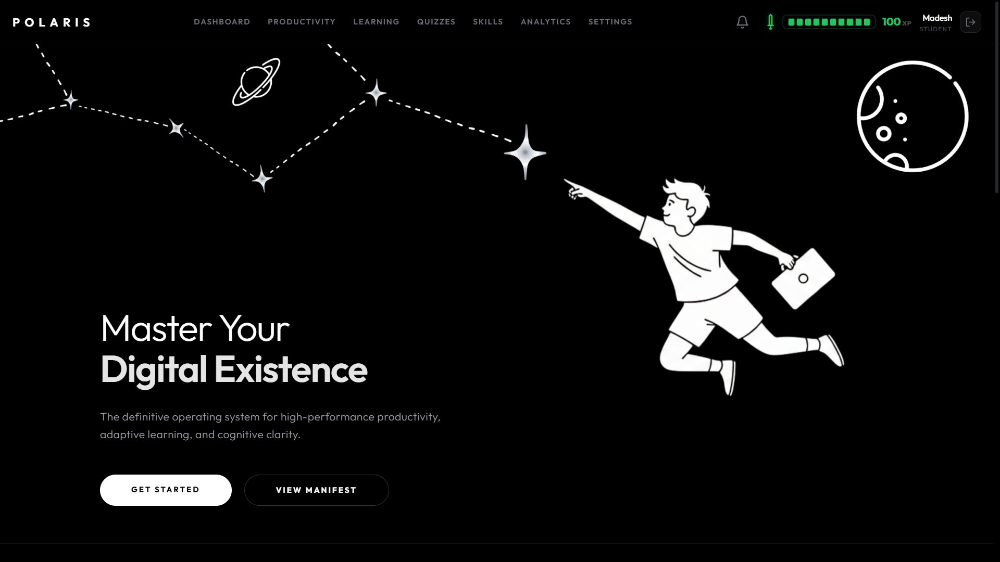
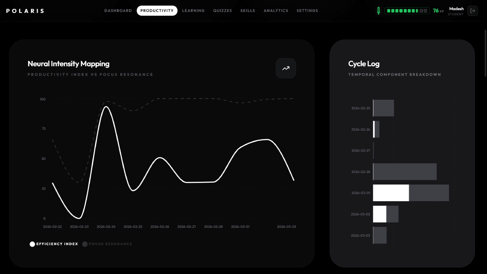

<h1 align="center">
  
</h1>

<p align="center">
  
  
  
  
</p>

---

# Polaris Tracker

Polaris Tracker is an AI-powered productivity analytics and monitoring platform designed to track user activity, analyze focus sessions, generate productivity insights, and provide intelligent monitoring through a browser extension and analytics dashboard.

The platform integrates real-time activity tracking, NLP-powered analysis, analytics visualization, and scalable backend infrastructure into a unified monitoring ecosystem.

---

## Dashboard

<p align="center">
  
</p>

---

# Core Features

## Productivity Monitoring
- Active and idle session tracking
- Focus time analysis
- Website usage statistics
- Session history analytics
- Real-time activity updates

## Analytics Dashboard
- Interactive productivity metrics
- Daily and weekly reports
- Timeline visualization
- User activity insights
- Progress monitoring

<p align="center">
  
</p>

## Chrome Extension
- Browser activity collection
- Lightweight telemetry system
- Background monitoring
- Real-time synchronization
- Manifest V3 architecture

## NLP Intelligence
- Behavior pattern analysis
- Semantic processing
- Productivity insight generation
- Recommendation engine
- Intelligent analytics

## Security & Privacy
- Token-based authentication
- Secure API communication
- Privacy-first architecture
- HTTPS and WebSocket security
- Minimal telemetry collection

---

# System Architecture

```text
 ┌──────────────────────────┐
 │    Chrome Extension      │
 │ Activity Tracking Layer  │
 └────────────┬─────────────┘
              │
              │ HTTPS / WSS
              ▼
 ┌──────────────────────────┐
 │      FastAPI Backend     │
 │ Authentication + APIs    │
 │ Analytics Processing     │
 └────────────┬─────────────┘
              │
      ┌───────┴────────┐
      ▼                ▼
 ┌───────────┐   ┌─────────────┐
 │   MySQL   │   │ NLP Engine  │
 │ Database  │   │ + FAISS AI  │
 └───────────┘   └─────────────┘
              │
              ▼
 ┌──────────────────────────┐
 │     React Dashboard      │
 │ Productivity Analytics   │
 └──────────────────────────┘
```

---

# Technology Stack

| Frontend | Backend | AI / NLP | Infrastructure |
|---|---|---|---|
| React.js | FastAPI | NLP Processing | MySQL |
| Vite | Python | FAISS Vector Search | Redis |
| JavaScript | Uvicorn | Semantic Analysis | Docker |
| HTML5 | REST APIs | Recommendation Engine | Linux |
| CSS3 | WebSockets | AI Analytics | GitHub |
| Tailwind CSS | Authentication APIs | Data Intelligence | Postman |

---

# Application Flow

```text
User Activity
      │
      ▼
Chrome Extension
      │
      ▼
FastAPI Backend APIs
      │
 ┌────┴─────┐
 ▼          ▼
MySQL     NLP Engine
 │          │
 └────┬─────┘
      ▼
React Dashboard
      │
      ▼
Analytics & Insights
```

---

# Project Structure

```bash
Polaris/
│
├── backend/
├── frontend/
├── extension/
├── screenshots/
|
└── README.md
```

---

# Modules

| Module | Description |
|---|---|
| Chrome Extension | User activity tracking |
| FastAPI Backend | APIs and analytics processing |
| NLP Engine | AI-powered insight generation |
| React Dashboard | Productivity visualization |
| MySQL Database | Persistent data storage |
| WebSocket Layer | Real-time synchronization |

---

# Deployment

| Service | Platform |
|---|---|
| Frontend | Netlify |
| Backend | Render / VPS |
| Database | MySQL |
| APIs | FastAPI |
| Extension | Chrome Browser |

---

# Repository

```bash
git clone https://github.com/Madeshmadmax7/Polaris.git
```
